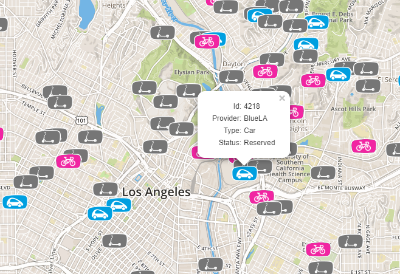

# MIDAS - MDS compliant mobility data service

A [City of LA MDS Specification](https://github.com/CityOfLosAngeles/mobility-data-specification) (Mobility Data Specification) compliant implementation of the Agency API.

## Goals & non-goals

### Goals

* Ultimately MDS compliance
* A way to test MDS ideas on a real implementation as we believe it is hard to specify a quality API without a 
reference implementation alongside
* Developer-friendly to be able for all stakeholders to contribute

### Non-goals

* High-performance: we favor developer-friendliness over performance
* Full-featured UI: this is an API-first software and for a first iteration, the UI is not paramount
* Data-analysis: analysis should be done by other apps consuming the consumer API of this app

## Tech & requirements

* Python 3 with [Django](https://www.djangoproject.com/) and [GeoDjango](https://docs.djangoproject.com/en/2.1/ref/contrib/gis/)
* Postgresql with [PostGIS](https://postgis.net/)
* Swagger for interactive API documentation (available on /schema)

## How to run

### Backend

* Install and configure requirements (see above)
* In `midas/`, run `pip install .[dev]` to install dependencies
* You need following env variables: MIDAS_DB_NAME, MIDAS_DB_USER and MIDAS_DB_PASSWORD
* To initialize the database, run `python manage.py migrate`
* To start the backend, run `python manage.py runserver`

### Frontend

See dedicated README in [front/README.md](front/README.md)

## TODO

- [ ] API: Testing a more restful approach
  - [ ] Add trips
  - [ ] Add multiple mobility modes
- [ ] Authentication
- [ ] Clarify if service_areas should be integrated in this app or in another one that would focus on zoning
- [ ] ...
